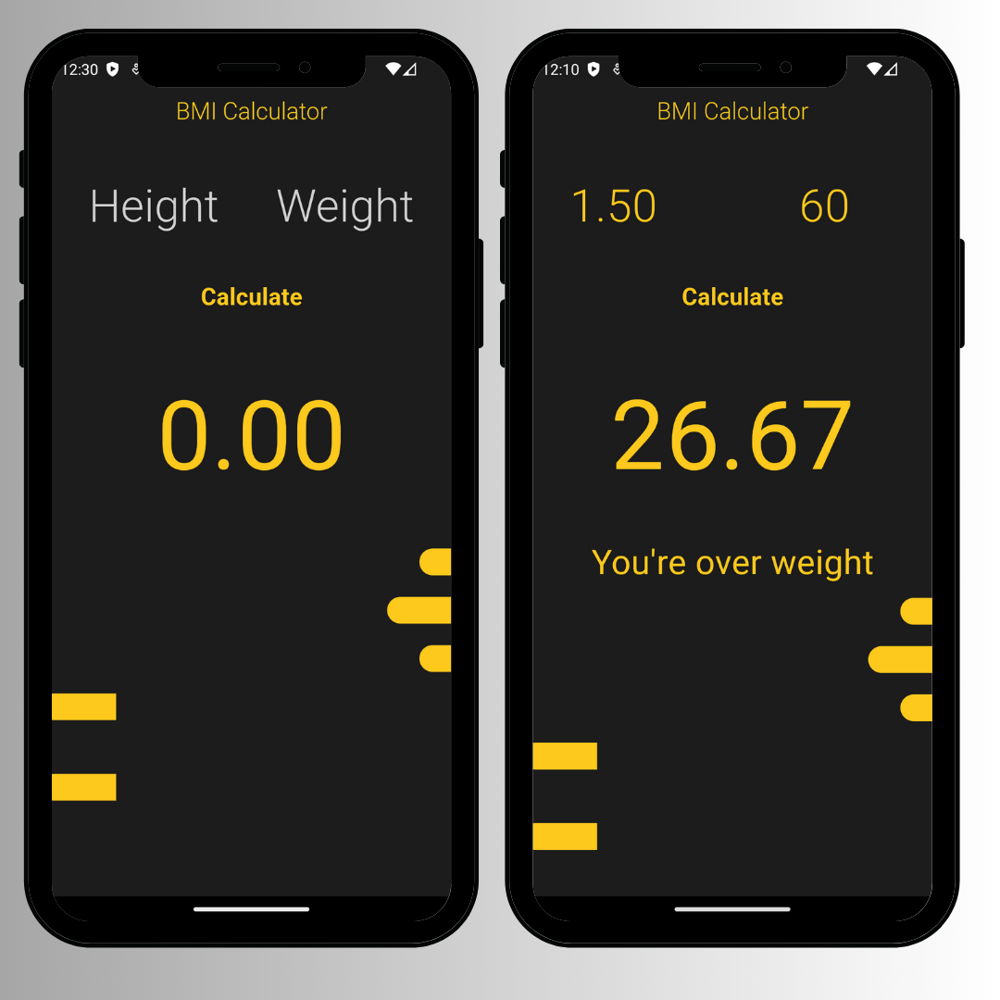

# flutter_bmi_calculator

 <h1>BMI Calculator App</h1>

<p>
    An BMI Calculator App that measures your Body Mass Index with decimal precision!
  </p>

  
<!-- Table of Contents -->
<details>
<summary>

# :notebook_with_decorative_cover: Table of Contents

</summary>

<!-- About the Project -->
## :star2: About the Project
<div align="center"> 
  
</div>
<br />

<!-- Folder Structure -->
### :bangbang: Folder Structure

Here is the code folder structure.
```
bmicalc/
|- android
|- ios
|- lib/
  |-- screens/
  |-- constants.dart
  |-- widgets.dart
  |-- main.dart
```

Now, lets dive into the lib folder which has the main code for the application.
<!-- TechStack -->
### :space_invader: Tech Stack


<!-- Getting Started -->
## 	:toolbox: Getting Started

<!-- Installation -->
### :gear: Installation

#### Step 1:
Download or clone this repo by using the link below:

```bash
 https://github.com/ladunjexa/bmi-calculator-app
```

#### Step 2:

Go to project root and execute the following command in console to get the required dependencies:

```bash
  flutter pub get
```

<!-- Run Locally -->
### :running: Run Locally

Clone the project

```bash
  git clone https://github.com/ladunjexa/bmi-calculator-app
```

Go to the project directory

```bash
  cd bmi-calculator-app
```

Install dependencies

```bash
  flutter pub get
```

Start the application

```bash
  flutter run
```

<p align="right">(<a href="#readme-top">back to top</a>)</p>


